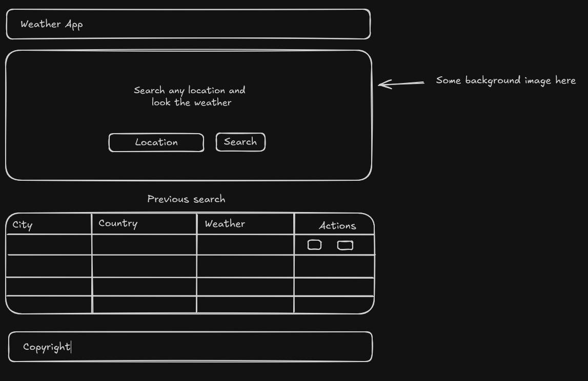

# UNET Fullstack Dev Course - Frontend

This project is only for educational purpose to complete the first part of the Fullstack Course.

The project is a classic Weather app, the app fetch the weather using the Geolocation API and get the information from Open-Meteo API. Using Web Storage API, the app save the data creating a list of previous search, allowing the user to see again previous locations without search. The user can delete any or all locations from this list.

## Features
* Fetch API to get the Weather info
* Web Storage API to save data on every search
* Using CSS and JavaScript Vanilla for better understanding of this technologies
* Responsive design
* Improving Accessibility

## Structure

## Visual Design

Fonts: Poppins for titles and Raleway for text

