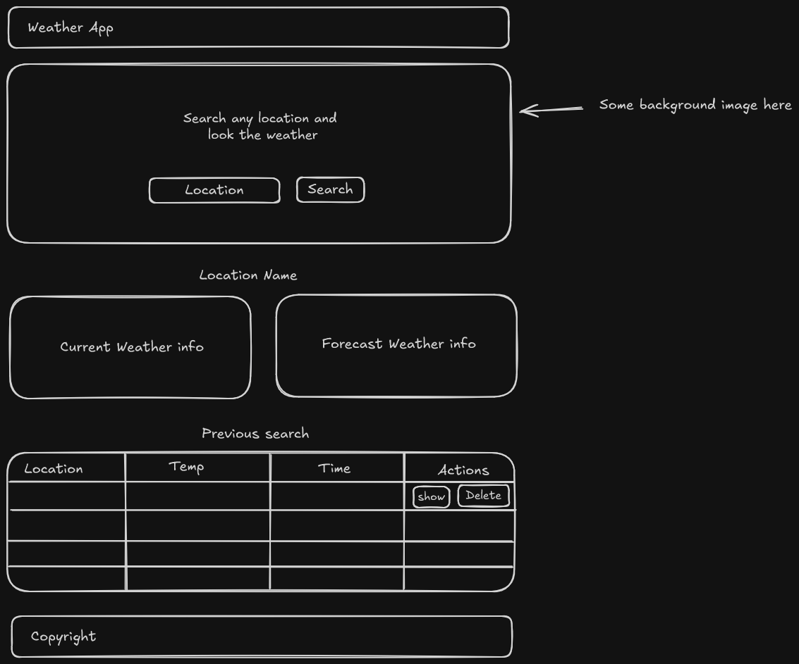

# UNET Fullstack Dev Course - Frontend

This project is only for educational purpose to complete the first part of the Fullstack Course.

The project is a classic Weather app, the app fetch the weather using the Geolocation API and get the information from Open-Meteo API. To get the first location name I use the lat and long data from the Geolocation API, them I use the LocationIQ APi to make a Reverse Geocoding fetch. Using Web Storage API, the app save the data creating a list of previous search, allowing the user to see again previous locations without fetching new data again. The user can delete the search from this list.

## Features
* Fetch API to get the Weather info
* Web Storage API to save data on every search
* Using CSS and JavaScript Vanilla for better understanding of this technologies
* Responsive design

## Structure

## Visual Design

Palette colors

Fonts: Poppins for titles and Raleway for text

